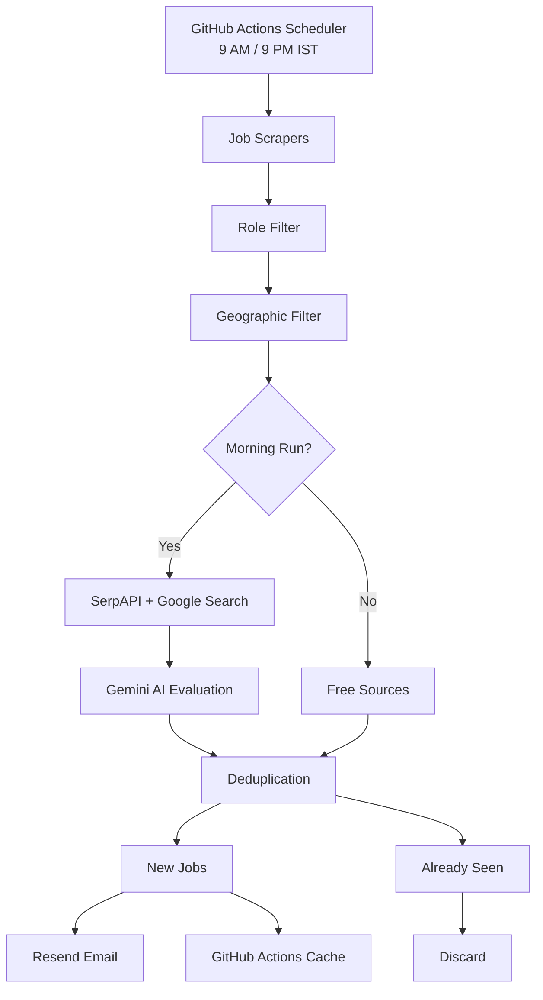

# 🤖 Job Alert Bot — AI-Powered Job Hunter

> An automated, AI-powered job discovery system that searches for relevant **2–3 year / mid-level opportunities**, evaluates them against your candidate profile using Gemini, filters by geography and experience, removes duplicates, and delivers job alerts by email — all running automatically through GitHub Actions.

---

## 🚀 What It Does

The Job Alert Bot runs automatically twice every day:

**9:00 AM IST**

* Searches Google Jobs through SerpAPI
* Runs 8 targeted job searches
* Collects India and Remote opportunities
* Filters jobs against your target roles and experience level
* Evaluates relevant jobs using Gemini AI
* Removes previously seen jobs
* Sends new matches by email

**9:00 PM IST**

* Runs the free job sources
* Performs another job discovery pass
* Uses the same filtering and deduplication system
* Sends newly discovered matches by email

The system is designed to run continuously with **minimal manual maintenance**.

---

## ✨ Features

| Feature                           | Details                                                                            |
| --------------------------------- | ---------------------------------------------------------------------------------- |
| 🔎 **Multi-source Job Discovery** | RemoteOK, WeWorkRemotely, Y Combinator, Remotive and SerpAPI/Google Search         |
| 🔍 **SerpAPI Search**             | 8 targeted searches for Power BI, BI, Data Analyst and Data Engineering roles      |
| 🧠 **AI Match Scoring**           | Gemini evaluates jobs against the candidate profile                                |
| 🎯 **2–3 YOE Targeting**          | Designed for mid-level opportunities rather than fresher-only roles                |
| 🇮🇳 **India + Remote Filtering** | Prioritizes India, WFH and global remote opportunities                             |
| 🌍 **Global Secondary Filter**    | Allows selected reputable global companies                                         |
| 🚫 **Experience Filtering**       | Removes internships, fresher roles and clearly over-experienced positions          |
| 🧹 **Role Filtering**             | Removes unrelated roles such as sales, HR, marketing and non-data engineering jobs |
| 🚶 **Walk-in Detection**          | Detects walk-in interviews, hiring drives and immediate-joining opportunities      |
| 🔗 **Direct Application URLs**    | Preserves the original job/application URL whenever available                      |
| ♻️ **Deduplication**              | Previously seen jobs are not repeatedly alerted                                    |
| 💾 **Actions Cache Database**     | Persists job history without committing the database to Git                        |
| 📧 **Email Alerts**               | Sends job notifications using Resend                                               |
| ⚡ **Concurrent Scraping**         | Scrapers run concurrently using `Promise.allSettled`                               |
| 🛡️ **Fail-safe Execution**       | A failed scraper does not automatically stop the other sources                     |
| ☁️ **Serverless**                 | Runs entirely through GitHub Actions                                               |
| 💰 **Low Cost**                   | Uses free/low-cost APIs and GitHub Actions                                         |

---

# 🧠 AI Job Matching

Relevant jobs can be evaluated using Gemini.

The evaluator considers:

* Target job title
* Candidate skills
* Core technology stack
* Target roles
* Target locations
* Experience requirements
* BI / Power BI relevance
* Data Analytics relevance
* Azure / Data Engineering relevance
* Seniority and experience mismatch

Each evaluated job receives a **match score from 0–100**.

Example:

```text
🏢 Company: Example Technologies
💼 Role: Power BI Developer
📍 Location: Bangalore, India

📊 AI Match Score: 87%

💡 Strong match based on Power BI, SQL, DAX,
   Azure and Business Intelligence requirements.
```

The AI is used as a **ranking and relevance layer**, not as the only filtering mechanism.

---

# 🎯 Current Candidate Profile

The included profile is configured around:

### Core Stack

* Power BI
* DAX
* Power Query
* SQL
* Microsoft Excel
* Azure
* Azure Data Factory
* Azure Synapse Analytics
* Data Engineering
* Data Analysis
* Business Intelligence
* ETL
* Data Visualization

### Target Roles

* BI Analyst
* Business Intelligence Analyst
* Power BI Analyst
* Power BI Developer
* Power BI Consultant
* Data Analyst
* Junior Data Analyst
* Azure Data Engineer
* Azure Data Engineering
* Data Engineer
* Junior Data Engineer
* BI Developer
* Business Intelligence Developer

### Experience Target

```text
2–3 years / Mid-level / 2+ years
```

The profile can be customized in:

```text
data/resume_profile.json
```

---

# 🔎 Job Discovery

## SerpAPI

The morning run uses **8 targeted Google searches** covering areas such as:

```text
BI Analyst / Business Intelligence
Power BI Developer / Power BI Analyst
Data Analyst / SQL / Power BI
Azure Data Engineer
Azure Data Factory
Data Engineer / Azure / SQL / ETL
Naukri-targeted searches
Walk-in / hiring-drive searches
```

The search layer also applies freshness filtering so the system prioritizes recently posted jobs.

### SerpAPI Budget

The morning workflow performs:

```text
8 queries/day × ~30 days
≈ 240 searches/month
```

This is designed to remain within a **250-search/month allowance**.

---

# 🌍 Geographic Filtering

The bot prioritizes:

### 🇮🇳 India

Including major locations such as:

* Bangalore / Bengaluru
* Hyderabad
* Chennai
* Pune
* Mumbai
* Delhi / NCR
* Noida
* Gurgaon / Gurugram
* Ahmedabad
* Kolkata
* Jaipur
* Kochi
* Coimbatore
* Chandigarh
* and other Indian locations

### 🌐 Remote

The system recognizes:

```text
Remote
Work From Home
WFH
Worldwide
Global
Distributed
Remote-first
Location Independent
Virtual
Telecommute
```

### 🌎 Global Opportunities

Non-India, non-remote positions can be considered as secondary opportunities when the company belongs to the configured reputable-company list.

---

# 🚫 Smart Filtering

The filtering system is designed to remove obvious mismatches before AI evaluation.

### Example excluded categories

```text
Sales
Marketing
HR / Human Resources
Recruiting
Legal
Project Management
Product Management
Customer Support
Customer Success
Mechanical Engineering
Civil Engineering
Electrical Engineering
Supply Chain
Logistics
```

### Early-career exclusions

The system excludes listings explicitly indicating:

```text
Intern
Internship
Trainee
Fresher
Freshers
New Grad
New Graduate
Campus Hiring
Entry Level
0–1 years
0–2 years
```

### Excessive-experience exclusions

Listings explicitly requiring approximately:

```text
5+ years
6+ years
7+ years
8+ years
9+ years
10+ years
```

are filtered out.

> Job titles such as **Senior** or **Principal** are not automatically rejected. The actual experience requirement is considered instead.

---

# 🚶 Walk-in Job Detection

The bot detects keywords such as:

```text
Walk-in
Walk in interview
Walk-in drive
Hiring drive
Job drive
Open interview
Immediate joining
Urgent hiring
Mass hiring
```

This allows walk-in opportunities to be identified separately from normal job postings.

---

# ♻️ Deduplication

The bot maintains a local job database:

```text
data/seen_jobs.json
```

In GitHub Actions, this database is persisted using **GitHub Actions Cache**.

This means:

* Previously alerted jobs are not repeatedly sent
* The repository does not receive daily database commits
* No external PostgreSQL/Redis database is required
* Job history survives between workflow runs

The database is also cleaned periodically to prevent unlimited growth.

---

# 📧 Email Notifications

The production notification channel uses **Resend**.

The workflow sends:

```text
New relevant jobs
        ↓
AI evaluation
        ↓
Deduplication
        ↓
Email notification
```

Email configuration is supplied through GitHub Secrets.

---

# ⏰ Schedule

| Run        |  Time (IST) | SerpAPI | Gemini | Email |
| ---------- | ----------: | ------: | -----: | ----: |
| 🌅 Morning | **9:00 AM** |       ✅ |      ✅ |     ✅ |
| 🌙 Evening | **9:00 PM** |       ❌ |      ❌ |     ✅ |

### Why two runs?

The morning run performs the expensive/high-value search using SerpAPI and Gemini.

The evening run provides a second discovery pass using free sources without consuming additional SerpAPI/Gemini usage.

---

# ⚙️ GitHub Actions

The project contains three workflows:

```text
.github/workflows/
├── scrape-morning.yml
├── scrape-evening.yml
└── scrape-seed.yml
```

### `scrape-morning.yml`

Full production job search:

```text
SerpAPI
   ↓
Role Filter
   ↓
Geographic Filter
   ↓
Gemini AI
   ↓
Deduplication
   ↓
Email
```

### `scrape-evening.yml`

Free-source second scan:

```text
Free Scrapers
   ↓
Role Filter
   ↓
Geographic Filter
   ↓
Deduplication
   ↓
Email
```

### `scrape-seed.yml`

One-time initialization workflow.

It catalogs currently available jobs as already seen so the first production run does not send hundreds of old listings.

**Run this only during initial setup.**

---

# 🔐 GitHub Secrets

The production workflow requires:

| Secret           | Purpose                     |
| ---------------- | --------------------------- |
| `SERPAPI_KEY`    | Google job/search discovery |
| `GEMINI_API_KEY` | AI job evaluation           |
| `RESEND_API_KEY` | Email delivery              |
| `EMAIL_FROM`     | Sender address              |
| `EMAIL_TO`       | Recipient address           |

Secrets should be stored under:

```text
GitHub
→ Repository
→ Settings
→ Secrets and variables
→ Actions
```

Never commit `.env` or API keys to the repository.

---

# 🛠️ Installation

## 1. Clone the repository

```bash
git clone https://github.com/YOUR_USERNAME/Job_Alert.git
cd Job_Alert
```

## 2. Install dependencies

```bash
npm install
```

## 3. Configure environment variables

Create:

```text
.env
```

Example:

```env
USE_SERPAPI=true
USE_LLM=true

SERPAPI_KEY=your_serpapi_key
GEMINI_API_KEY=your_gemini_api_key

RESEND_API_KEY=your_resend_api_key
EMAIL_FROM=onboarding@resend.dev
EMAIL_TO=your_email@example.com
```

Never commit `.env`.

---

# 🧪 Local Testing

### Standard dry run

```bash
npm test
```

This runs:

```text
Scraping
→ Filtering
→ Deduplication
```

without sending notifications.

### Dry run with AI

```bash
cross-env USE_LLM=true DRY_RUN=true node src/main.js
```

### Full local run

```bash
npm start
```

Use this only when your notification credentials are configured correctly.

---

# 🌱 First-Time Setup

After pushing the project to GitHub:

### Step 1

Add the required GitHub Secrets.

### Step 2

Run:

```text
Actions
→ Seed Run
→ Run workflow
```

The seed workflow:

* Discovers current listings
* Adds them to the deduplication database
* Sends no job alerts

### Step 3

Run:

```text
Actions
→ Morning Job Alerts
→ Run workflow
```

This verifies the complete production pipeline.

After that, scheduled execution takes over automatically.

---

# 📁 Project Structure

```text
Job_Alert/
│
├── .github/
│   └── workflows/
│       ├── scrape-morning.yml
│       ├── scrape-evening.yml
│       └── scrape-seed.yml
│
├── data/
│   └── resume_profile.json
│
├── src/
│   ├── core/
│   │   ├── database.js
│   │   ├── filter.js
│   │   ├── geoFilter.js
│   │   └── llmEvaluator.js
│   │
│   ├── notifiers/
│   │   └── email.js
│   │
│   ├── scrapers/
│   │   ├── index.js
│   │   ├── serpapi.js
│   │   ├── remoteok.js
│   │   ├── weworkremotely.js
│   │   ├── ycombinator.js
│   │   └── remotive.js
│   │
│   └── main.js
│
├── .env.example
├── .gitignore
├── package.json
├── package-lock.json
└── README.md
```

---

# 🏗️ System Architecture



---

# 🔄 Pipeline

The production pipeline follows:

```text
Job Discovery
      ↓
Normalization
      ↓
Role Relevance
      ↓
Experience Filtering
      ↓
Geographic Filtering
      ↓
AI Evaluation
      ↓
Deduplication
      ↓
Email Notification
      ↓
Persist Job History
```

The order is intentional.

AI evaluation occurs **after deterministic filtering**, reducing unnecessary API usage.

---

# 🧩 Design Decisions

| Decision       | Implementation                         | Reason                                           |
| -------------- | -------------------------------------- | ------------------------------------------------ |
| Scheduling     | GitHub Actions                         | Serverless automation                            |
| Morning Search | SerpAPI                                | Broad job discovery                              |
| AI Matching    | Gemini                                 | Resume-aware relevance scoring                   |
| Evening Search | Free sources                           | Additional discovery without API cost            |
| Database       | Actions Cache                          | No external database required                    |
| Deduplication  | Normalized job URL                     | Prevent repeated alerts                          |
| Concurrency    | `Promise.allSettled`                   | One source failure doesn't stop all sources      |
| Notifications  | Resend                                 | Simple transactional email                       |
| Configuration  | Environment variables / GitHub Secrets | Keeps credentials outside source code            |
| Filtering      | Deterministic rules + AI               | Reduces irrelevant results before LLM evaluation |
| Deployment     | GitHub Actions                         | No server maintenance                            |

---

# 📊 Current Target

The bot is currently optimized for:

```text
Experience:
2–3 years / Mid-level / 2+ years

Primary locations:
India
Remote
Work From Home

Primary domains:
Business Intelligence
Power BI
Data Analytics
Data Engineering
Azure Data Engineering
ETL
Data Visualization

Primary technologies:
Power BI
DAX
Power Query
SQL
Azure
Azure Data Factory
Azure Synapse Analytics
Microsoft Excel
```

---

# 🔮 Future Improvements

Potential future enhancements include:

* Job salary extraction and ranking
* Company quality scoring
* Better job-description parsing
* More direct company career-site searches
* LinkedIn application tracking
* Historical job analytics
* Weekly job-search summaries
* Automatic resume tailoring
* Application tracking
* Interview tracking
* More sophisticated AI ranking

---

# 📜 License

This project is intended for personal job-search automation and experimentation.

Use third-party APIs and job platforms according to their respective terms of service.

---

## ⭐ Project Status

**Status: Production / Automated**

The system is deployed through GitHub Actions and is designed to run automatically twice daily without manual intervention.

**Morning:** Full AI-powered search
**Evening:** Free-source secondary search
**Delivery:** Email
**Deduplication:** GitHub Actions Cache
**AI:** Gemini
**Search:** SerpAPI + free job sources
